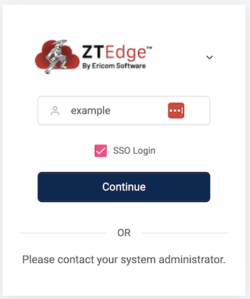
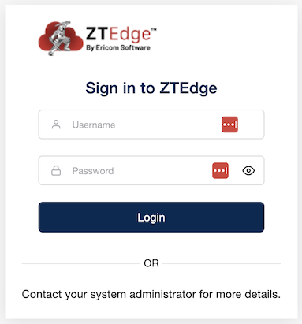
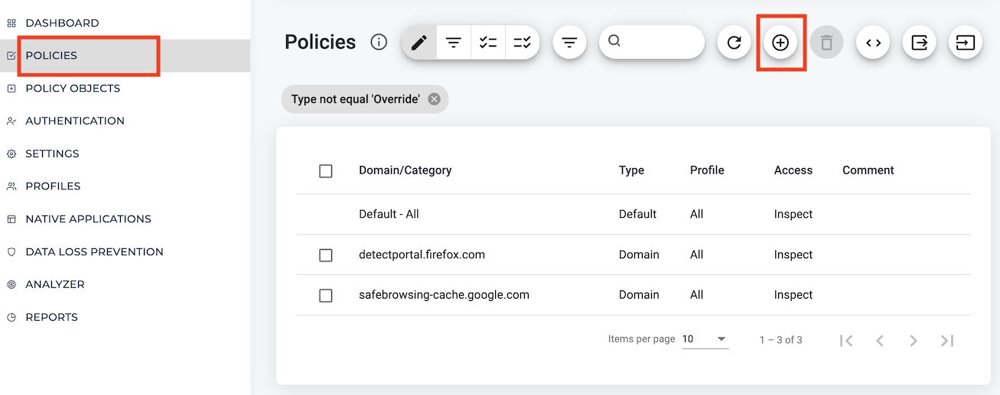
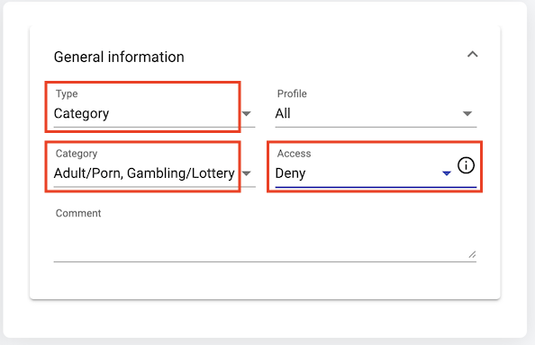
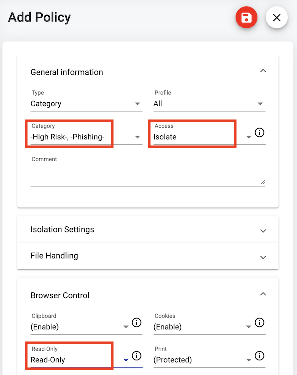
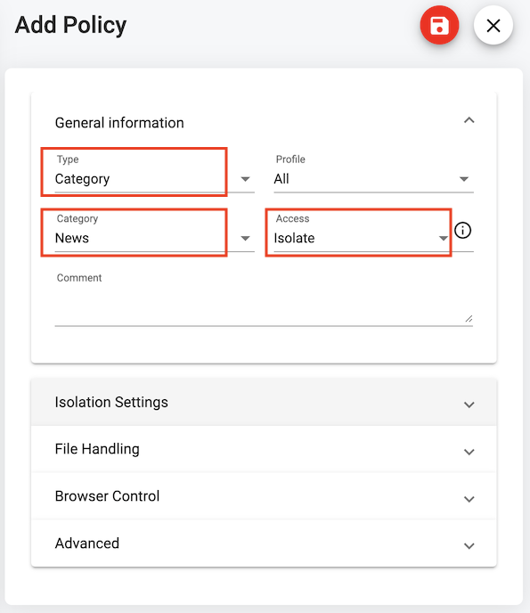
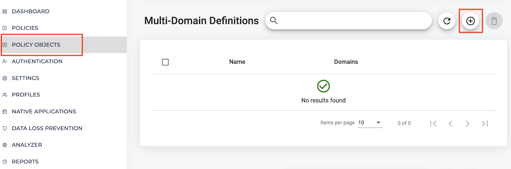
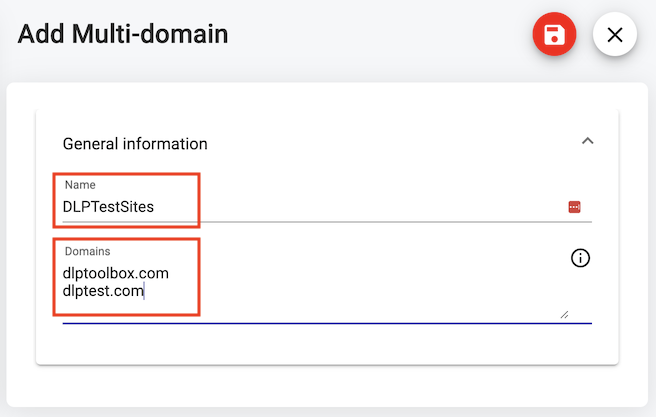
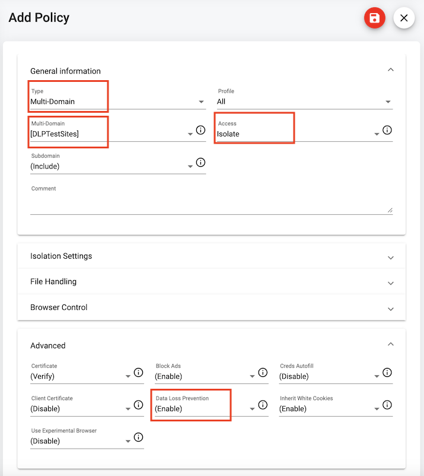

# ZTEdge Security Workshop

## To Do
1. In progress still...finish README
2. Test lab run through
3. Team review

## Contents

- [Introduction](#introduction)
- [Requirements](#requirements)
- [Lab 1: Securing "The Dirty Internet"](#lab-1-securing-the-dirty-internet)

## Introduction

Welcome to the ZTEdge Security Workshop training and demo guide. This lab will teach you the fundamentals of [Ericom's ZTEdge platform](https://www.ericom.com). You will learn how to configure policies and setup zero trust controls to address zero-day web and email threats, as well as unmanaged devices and BYOD risks. Organizations adopting [Secure Access Service Edge (SASE)](https://www.ericom.com/what-is-sase) strategies for network security can use the ZTEdge cloud-native security platform to protect users, apps, and data from advanced cyberthreats, while enabling safe, secure use of productivity-enhancing web apps and tools.

## Requirements

- RDP client
- Windows VM (for client testing)
- Access to ZTAdmin portal

***Note: Credentials to the RDP machines and the ZTAdmin portal will be provided by the lab instructor.***

## Lab 1: Securing "The Dirty Internet"

1. Launch the ZTAdmin portal https://ztadmin.ericomcloud.net

2. Provide tenant name, select "SSO Login", and hit "Continue" (*see instructor for tenant name*)

3. Login with username and password

| Username | Password |
| -------- | -------- |
| admin | (see instructor) |

4. Select "Policies" and hit the "+" to add a new policy

For reference, policy actions and types are listed below.

| Policy Actions |
| -------------- |
| Allow (No Inspection) |
| Deny (Block) |
| Inspect |
| Isolate |

| Policy Types |
| ------------ |
| Domain |
| Category |
| Multi-Domain |
| Corporate Application |
| Web Application |

5. Create a policy to deny categories "Adult" and "Gambling", then click "Save"

| Item | Option |
| ---- | ------ |
| Type | Category |
| Category | "Adult" and "Gambling" |
| Access | Deny |

6. Create a policy to restrict categories "High Risk" and "Phishing" as Read-Only, then click "Save"

| Item | Option |
| ---- | ------ |
| Type | Category |
| Category | "High Risk" and "Phishing"  |
| Access | Isolate |
| Browser Control | Read-Only |

7. Create a policy to isolate the category "News", then click "Save"

| Item | Option |
| ---- | ------ |
| Type | Category |
| Category | "News"  |
| Access | Isolate |

8. Select "Policy Objects" and hit the "+" to add a new Multi-Domain Definition

9. Create a Multi-Domain object for DLP testing sites, then click "Save"

| Item | Option |
| ---- | ------ |
| Name | DLPTestSites |
| Domains | dlptoolbox.com   dlptest.com |

10. Go back to "Policies" and hit the "+" to add a new policy

11. Create a policy to isolate the DLPTestSites object, then click "Save"

| Item | Option |
| ---- | ------ |
| Type | Multi-Domain |
| Multi-Domain | DLPTestSites  |
| Access | Isolate |
| Data Loss Prevention | Enabled |

12. 
